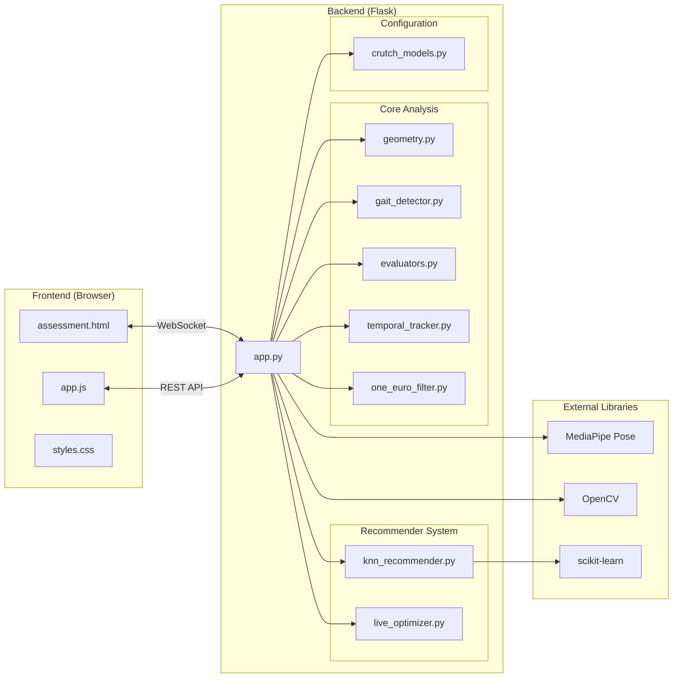
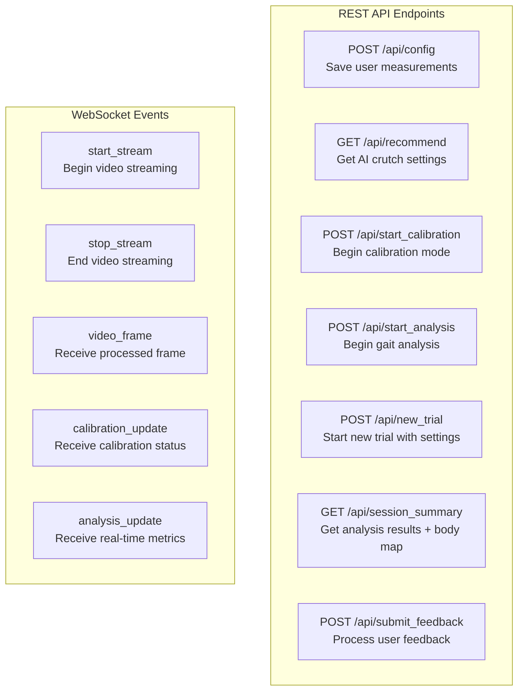
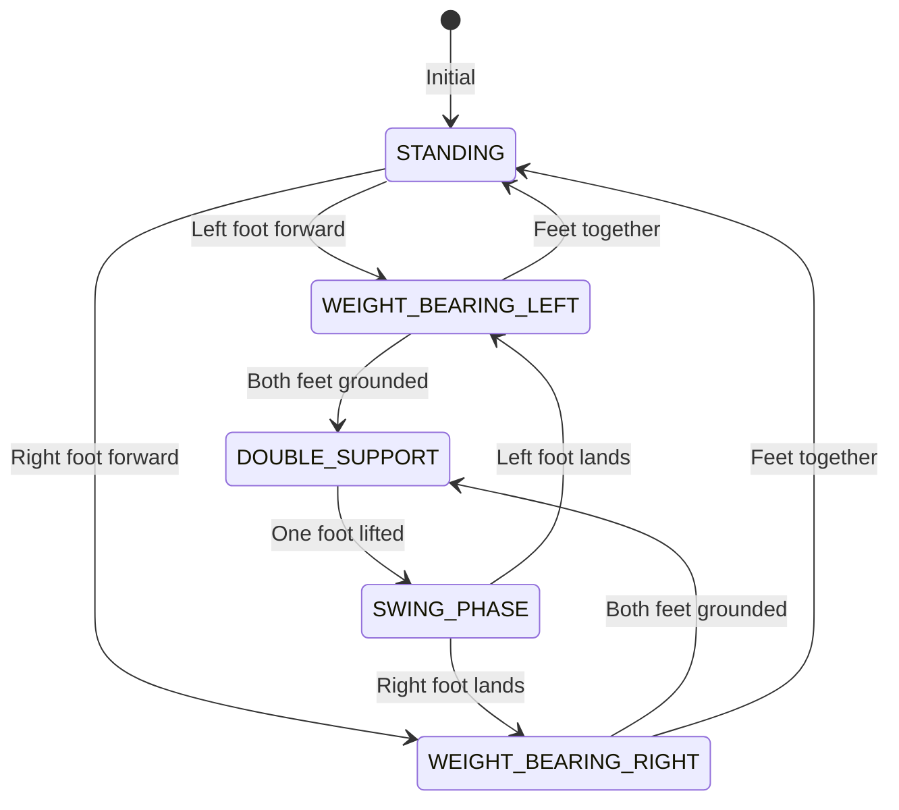
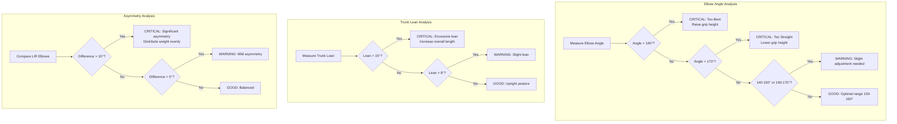
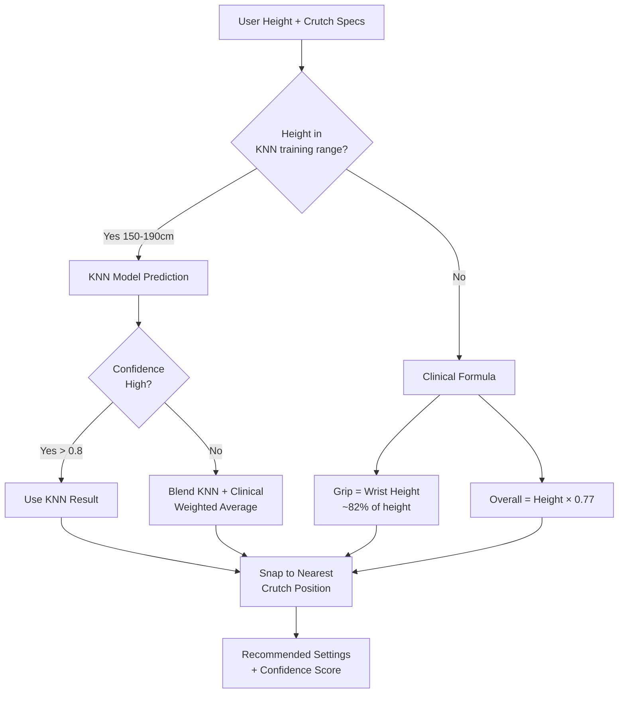

# CrutchGuard Application Flowchart

## User Flow Overview

```mermaid
flowchart TD
    subgraph Step1["Step 1: Body Measurements"]
        A[Start] --> B[Enter Height]
        B --> C[Enter Weight]
        C --> D[Select Unit System<br/>Imperial/Metric]
        D --> E[Continue]
    end

    subgraph Step2["Step 2: Crutch Configuration"]
        E --> F[Enter Grip Height Range<br/>Min/Max + Positions]
        F --> G[Enter Overall Length Range<br/>Min/Max + Positions]
        G --> H[Get AI Recommendation]
        H --> I{KNN Model<br/>Available?}
        I -->|Yes| J[KNN Hybrid Recommendation]
        I -->|No| K[Clinical Formula Fallback]
        J --> L[Display Recommended<br/>Grip & Overall Positions]
        K --> L
        L --> M[User Adjusts Crutches<br/>to Recommended Settings]
        M --> N[Continue to Calibration]
    end

    subgraph Step3["Step 3: Calibration"]
        N --> O[Start Camera Stream]
        O --> P[MediaPipe Pose Detection]
        P --> Q{All Body Parts<br/>Visible?}
        Q -->|No| R[Show Visibility Checklist<br/>Head/Arms/Legs/Distance]
        R --> P
        Q -->|Yes| S{Correct Distance?<br/>5-7 feet}
        S -->|No| T[Show Distance Warning]
        T --> P
        S -->|Yes| U[Hold Still for<br/>Calibration 30 frames]
        U --> V{Calibration<br/>Complete?}
        V -->|No| U
        V -->|Yes| W[Calculate pixels_per_cm<br/>from leg length]
        W --> X[Auto-advance to Step 4]
    end

    subgraph Step4["Step 4: Gait Analysis"]
        X --> Y[Start Analysis Mode]
        Y --> Z[Process Video Frames]
        Z --> AA[Detect Gait Phase<br/>Standing/Weight-Bearing/Swing]
        AA --> AB[Calculate Angles]
        AB --> AC[Right/Left Elbow Angles]
        AB --> AD[Right/Left Knee Angles]
        AB --> AE[Trunk Lean Angle]
        AB --> AF[Step Length & Base Width]
        AC --> AG[Evaluate Metrics]
        AD --> AG
        AE --> AG
        AF --> AG
        AG --> AH[Display Real-time Feedback]
        AH --> AI[Store Session Frames<br/>for Analysis]
        AI --> AJ{User Clicks<br/>Finish Trial?}
        AJ -->|No| Z
        AJ -->|Yes| AK[Stop Camera Stream]
        AK --> AL[Go to Step 5]
    end

    subgraph Step5["Step 5: Feedback & Results"]
        AL --> AM[Fetch Session Summary]
        AM --> AN[Analyze Biomechanics<br/>from Weight-Bearing Frames]
        AN --> AO[Generate Body Map<br/>Color-coded by status]
        AO --> AP[Generate Issues List<br/>with recommendations]
        AP --> AQ[Display Body Analysis<br/>Visualization]
        AQ --> AR[User Rates Experience<br/>1-5 scale]
        AR --> AS[User Reports Issues<br/>Checkboxes]
        AS --> AT[Submit Feedback]
        AT --> AU{Settings<br/>Optimal?}
        AU -->|Yes| AV[Show Success Message]
        AU -->|No| AW[Show New Recommended<br/>Settings]
        AV --> AX{Try New<br/>Settings?}
        AW --> AX
        AX -->|Yes| AY[Apply New Settings]
        AY --> AZ[Increment Trial Number]
        AZ --> BA[Reset Issue Tracking]
        BA --> N
        AX -->|No| BB[Finish Session]
        BB --> BC[Show Final Summary]
        BC --> BD[Return to Home]
    end
```



## Data Flow Architecture



## API Endpoints



## Gait Phase Detection



## Body Map Status Logic



## Recommendation System Flow



---

## File Structure

```
crutch_gait_analysis/
├── app.py                      # Main Flask application
├── frontend/
│   ├── index.html              # Landing page
│   ├── assessment.html         # 5-step assessment flow
│   ├── css/
│   │   └── styles.css          # Global styles
│   └── js/
│       └── app.js              # Frontend JavaScript
├── backend/
│   ├── __init__.py
│   ├── config/
│   │   ├── __init__.py
│   │   └── crutch_models.py    # Crutch device profiles
│   ├── core/
│   │   ├── __init__.py
│   │   ├── geometry.py         # Angle/distance calculations
│   │   ├── gait_detector.py    # Gait phase detection
│   │   ├── evaluators.py       # Metric evaluation functions
│   │   ├── temporal_tracker.py # Moving average tracking
│   │   └── one_euro_filter.py  # Noise filtering
│   └── recommender/
│       ├── __init__.py
│       ├── knn_recommender.py  # KNN-based recommendations
│       └── live_optimizer.py   # Real-time optimization
├── models/
│   └── knn_crutch_model.joblib # Trained KNN model
└── misc/
    └── flowchart.md            # This file
```

## Key Technologies

| Component | Technology |
|-----------|------------|
| Backend Server | Flask + Flask-SocketIO |
| Pose Estimation | MediaPipe Pose |
| Video Processing | OpenCV |
| ML Model | scikit-learn KNN |
| Real-time Communication | WebSocket |
| Frontend | Vanilla JavaScript |
| Styling | CSS Custom Properties |
